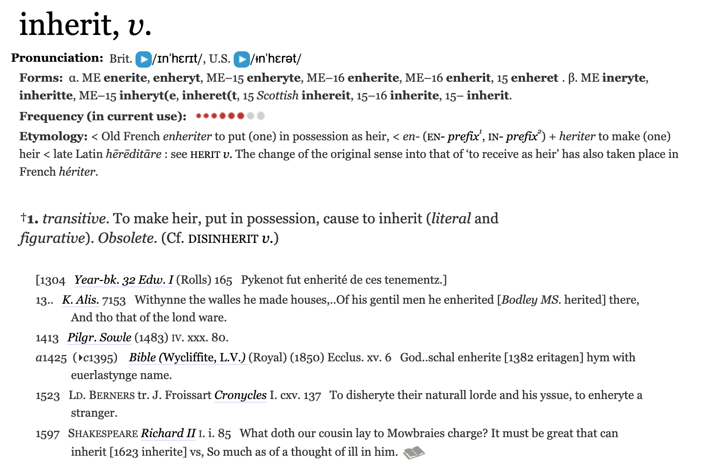
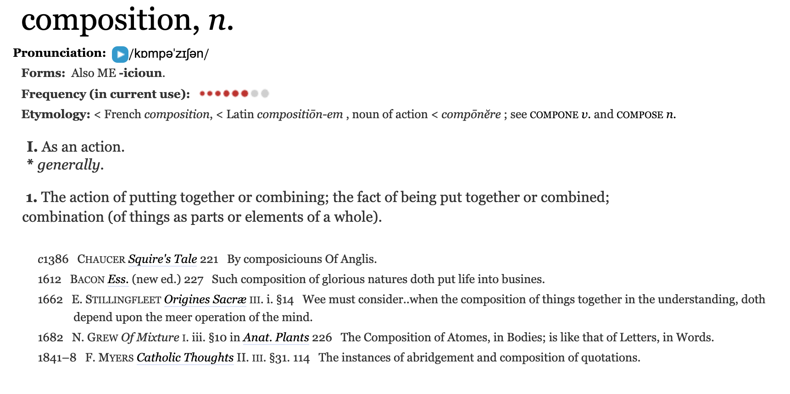
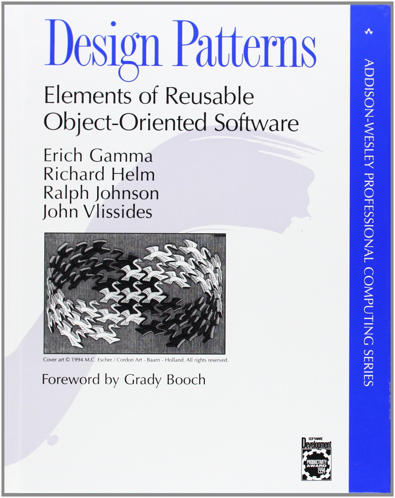

#

<a href="http://www.oed.com/view/Entry/95948"></a>

::: notes

Click through to Definition 2: To take or receive (property, esp. real property, or a right, privilege, rank, or title) as the heir of the former possessor (usually an ancestor), at his decease; to get, or come into possession of, by legal descent or succession.

:::

#

<a href="https://en.wikipedia.org/wiki/Darwin%27s_finches"></a>

::: notes

Darwin's Finches. Collected by Charles Darwin in the Galapagos Islands in the 1830s. Notice the similar characteristics that these birds have. This is because they inherited these traits from an ancestor from South America, the Tiaris obscurus or Dull-coloured grassquit.

The idea of inheritence is a way of extending and customizing classes without having to copy and paste code.

:::

# 


::: notes

Ok, but what do finches have to do with code? If you are writing a program that needs to model social media posts it may be useful for you to use inheritance to model what the different social media posts have in common in terms of their properties and methods (things you can do with them). Here is a UML diagram for this inheritance relation.

:::
#

``` {.python .numberLines .smaller}
class Post():
  def __init__(self, creator):
    self.creator = creator

class Tweet(Post):
  def retweet(self):
    print("retweeted by " + self.creator)

class Snap(Post):
  def expire(self):
    print("expired snap by " + self.creator)

snap = Snap("edsu")
snap.expire()
```

::: fragment
**expired snap by edsu**
:::

::: notes

There's no new syntax required to do inheritance. But notice how the Tweet and Snap classes are defined on line 5 and 9? See what is now in the parentheses? That is declaring that each inherit from a base class Post.

:::

#


``` {.python .numberLines .smaller}
class Post():
  def __init__(self, creator):
    self.creator = creator

class Tweet(Post):
  def retweet(self):
    print("retweeted by " + self.creator)

class Snap(Post):
  def expire(self):
    print("expired snap by " + self.creator)

tweet = Tweet(creator="edsu")
tweet.retweet()
```

::: fragment
**retweeted by edsu**
:::

# 

``` {.python .numberLines .smaller}
class Post():
  def __init__(self, creator):
    self.creator = creator

class Tweet(Post):
  def retweet(self):
    print("retweeted by " + self.creator)

class Snap(Post):
  def expire(self):
    print("expired snap by " + self.creator)

tweet = Tweet(creator="edsu")
tweet.expire()
```

::: fragment
**AttributeError: 'Tweet' object has no attribute 'expire'**
:::

#

``` {.python .numberLines .smaller}
class Post():
  def __init__(self, creator):
    self.creator = creator
  def delete(self):
    print("post deleted by " + self.creator)

class Tweet(Post):
  def retweet(self):
    print("retweeted by " + self.creator)

class Snap(Post):
  def expire(self):
    print("expired snap by " + self.creator)

tweet = Tweet(creator="edsu")
tweet.delete()
```

::: fragment
**post deleted by edsu**
:::

#

## Overriding Methods

``` {.python .numberLines .smaller}
class Post():
  def __init__(self, creator):
    self.creator = creator
  def update(self):
    print("post updated by " + self.creator)

class Tweet(Post):
  def update(self):
    print("you can never update tweets!")

class Snap(Post):
  def expire(self):
    print("expired snap by " + self.creator)

tweet = Tweet(creator="edsu")
tweet.update()
```

::: fragment
**you can never delete tweets!""**
:::

# Exercise

::: left

Remember our *Email* class that we used for processing the Enron email? Let's
*extend* the one I've uploaded as *email.py* to Module 7 in ELMS and add a
*method* that will return the *subject* of the email.

:::

# Composition

# 

<a href="http://www.oed.com/view/Entry/37795"></a>


#


::: columns

:::: column


::::

:::: column

<br>

**Pizza**

::::: incremental

* crust
* toppings
* cheese
* sauce

:::::

::::

:::

::: notes

A pizza is composed of multiple things.

:::

# 


::: notes

We can model the relationship between the Pizza class and the Topping objects of which it is composed. Notice the filled in diamond that indicates a composition relationship? Also notice the 0..7 that indicates there can be 0 to 7 toppings on a pizza.

:::

# 

``` {.python .numberLines .smaller}
class Topping():

    def __init__(self, name, num_pieces):
        self.name = name
        self.num_pieces = num_pieces

topping = Topping("pepperoni", 25)
print(topping)
```

::: fragment
**<__main__.Topping object at 0x10c6374e0>**
:::

::: notes

First lets create a Topping class that has a name, and a number of pieces.

:::

# 

``` {.python .numberLines .smaller}
class Pizza():

    def __init__(self):
        self.toppings = []

    def add_topping(self, topping):
        self.toppings.append(topping)

pizza = Pizza()
print(pizza)
```

::: fragment
**<__main__.Pizza object at 0x10c6374e0>**
:::

::: notes

Next lets create a Pizza class that initializes a list of toppings in the constuctor and has a method for adding toppings.

:::

#

``` {.python .numberLines .smaller}
class Pizza():
    def __init__(self):
        self.toppings = []
    def add_topping(self, topping):
        self.toppings.append(topping)

class Topping():
    def __init__(self, name, num_pieces):
        self.name = name
        self.num_pieces = num_pieces

pizza = Pizza()
pizza.add_topping(Topping("pepperoni", 18))
pizza.add_topping(Topping("mushrooms", 12))
pizza.add_topping(Topping("green peppers", 15))
print(pizza.toppings)
```

::: fragment
<div style="font-size: 18pt;">
[<__main__.Topping object at 0x10c9ae748>, <__main__.Topping object at 0x10c9aea58>, <__main__.Topping object at 0x10c9aea90>]
</div>
:::

::: notes
Here's what they look like when we put them together.
:::

#

``` {.python .smaller .numberLines}
class Topping():

    def __init__(self, name, num_pieces):
        self.name = name
        self.num_pieces = num_pieces

    def __repr__(self):
        return "{} pieces of {}".format(self.num_pieces, self.name))

pizza = Pizza()
pizza.add_topping(Topping("pepperoni", 18))
pizza.add_topping(Topping("mushrooms", 12))
pizza.add_topping(Topping("green peppers", 15))
print(pizza.toppings)
```

::: fragment
<div style="font-size: 18pt;">
[18 pieces of pepperoni, 12 pieces of mushrooms, 15 pieces of green peppers]
</div>
:::

::: notes

Every class you create can have a \_\_repr\_\_ method, short for representation, which can define how to print out instances of the class as strings. Which can be handy for debugging.

:::

# 

``` {.python .numberLines .smaller}
class Pizza():
    def __init__(self):
        self.toppings = []

    def add_topping(self, topping):
        self.toppings.append(topping)

    def num_pieces(self):
        count = 0
        for topping in self.toppings:
            count += topping.num_pieces
        return count

pizza = Pizza()
pizza.add_topping(Topping("pepperoni", 18))
pizza.add_topping(Topping("mushrooms", 12))
pizza.add_topping(Topping("green peppers", 15))
print(pizza.num_toppings())
```

::: fragment
**45**
:::

::: notes

Here we added a method to Pizza named num_pieces which returns the total number of pizza topping pieces on the pizza!

:::

# OOP Patterns

::: columns

:::: column

::::: left

Class *composition* is a much more useful Object Oriented Programming *pattern* than *inheritance*.

Inheritance should be used sparingly because elaborate inheritance hierarchies can be difficult to maintain over time as requirements change.

:::::

::::

:::: column

<a href="https://www.amazon.com/Design-Patterns-Elements-Reusable-Object-Oriented/dp/0201633612/"></a>

::::

:::

# 

<a href="https://en.wikipedia.org/wiki/The_Timeless_Way_of_Building"></a>

# Exercise

::: left

Download the `pizza.py` file from Module 7 and modify `Pizza.add_topping` to ensure that no more than 7 toppings are added.

If someone adds more than 7 toppings it should print *"Sorry that is too many toppings!"*.

:::


  